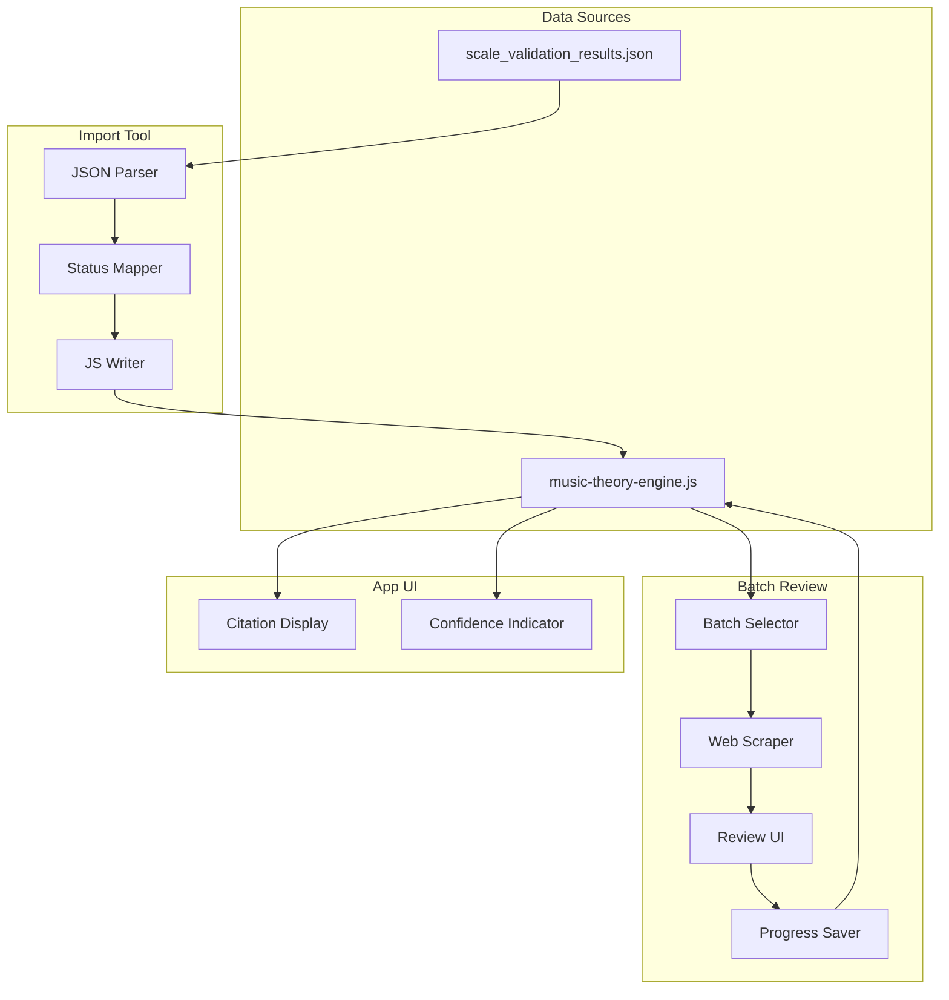

# Design Document: Scale Citation Integration

## Overview

This feature integrates validated scale sources from the web scraper validation report into the music theory app's academic citation system. It consists of three main components:

1. **Import Tool** - Python script to parse validation results and update `scaleCitations` in `music-theory-engine.js`
2. **UI Re-enablement** - Restore the disabled citation display in `modular-music-theory.html` with confidence indicators
3. **Batch Review Tool** - CLI tool to review REVIEW-status scales 10 at a time with automatic link finding

## Architecture



## Components and Interfaces

### 1. Import Tool (`import_validation_results.py`)

```python
class ValidationImporter:
    def __init__(self, validation_json_path: str, js_file_path: str):
        """Initialize with paths to validation results and music-theory-engine.js"""
        
    def load_validation_results(self) -> dict:
        """Load and parse the validation JSON file"""
        
    def extract_keep_scales(self) -> List[dict]:
        """Extract all scales with KEEP recommendation"""
        
    def extract_review_scales(self) -> List[dict]:
        """Extract all scales with REVIEW recommendation"""
        
    def map_to_citation_format(self, scale_result: dict) -> dict:
        """Convert validation result to scaleCitations format"""
        
    def update_scale_citations(self, updates: List[dict]) -> int:
        """Update scaleCitations in JS file, return count of updates"""
        
    def generate_summary(self) -> str:
        """Generate import summary report"""
```

### 2. Citation Format Mapper

Maps validation results to the existing `scaleCitations` structure:

```python
def map_to_citation_format(scale_result: dict) -> dict:
    """
    Input: {
        "scale_name": "dorian",
        "quality_score": 0.9,
        "recommendation": "KEEP",
        "sources": [{"title": "...", "url": "...", "snippet": "...", "quality": 0.9}]
    }
    
    Output: {
        "references": [
            {
                "type": "verified_source",
                "title": "...",
                "url": "...",
                "description": "...",
                "source": "Web Validation",
                "category": "verified" if quality >= 0.7 else "unverified",
                "verificationStatus": "VERIFIED via Web Search - Score: X",
                "verificationDate": "2025-12-12",
                "contentScore": X
            }
        ],
        "validationStatus": "verified" | "needs-review" | "limited-documentation",
        "validationDate": "2025-12-12"
    }
    """
```

### 3. Batch Review Tool (`batch_review_scales.py`)

```python
class BatchReviewTool:
    def __init__(self, validation_json_path: str, js_file_path: str):
        """Initialize with paths"""
        
    def get_review_progress(self) -> dict:
        """Load progress from review_progress.json"""
        
    def get_next_batch(self, batch_size: int = 10) -> List[dict]:
        """Get next N unreviewed REVIEW-status scales"""
        
    def search_scale(self, scale_name: str) -> List[dict]:
        """Use web scraper to find sources for a scale"""
        
    def present_for_review(self, scale: dict, sources: List[dict]) -> str:
        """Display scale and sources, get user decision"""
        
    def approve_source(self, scale_name: str, source: dict) -> None:
        """Add approved source to scaleCitations"""
        
    def reject_all_sources(self, scale_name: str) -> None:
        """Mark scale as manually-reviewed-no-sources"""
        
    def save_progress(self) -> None:
        """Save review progress to JSON file"""
        
    def run_batch(self) -> dict:
        """Run interactive batch review session"""
```

### 4. UI Citation Display

Re-enable and enhance the citation display in `modular-music-theory.html`:

```javascript
function renderScaleCitation(scaleType) {
    const citation = musicTheory.getScaleCitation(scaleType, 'html');
    const status = musicTheory.scaleCitations[scaleType]?.validationStatus;
    
    // Confidence indicator
    const indicator = getConfidenceIndicator(status);
    
    // Render to container
    const container = document.getElementById('piano-scale-info');
    container.innerHTML = indicator + citation;
}

function getConfidenceIndicator(status) {
    switch(status) {
        case 'verified': return '<span class="confidence-verified">✅ Well-documented</span>';
        case 'needs-review': return '<span class="confidence-review">⚠️ Limited documentation</span>';
        case 'limited-documentation': return '<span class="confidence-limited">❓ Needs review</span>';
        default: return '';
    }
}
```

## Data Models

### Validation Result (Input)

```typescript
interface ValidationResult {
    scale_name: string;
    display_name: string;
    intervals: number[];
    quality_score: number;
    recommendation: 'KEEP' | 'REVIEW' | 'REMOVE';
    reason: string;
    sources: Source[];
}

interface Source {
    title: string;
    url: string;
    snippet: string;
    quality: number;
}
```

### ScaleCitation (Output)

```typescript
interface ScaleCitation {
    description: string;
    culturalContext?: CulturalContext;
    references: Reference[];
    validationStatus: 'verified' | 'needs-review' | 'manually-verified' | 'limited-documentation';
    validationDate: string;
}

interface Reference {
    type: string;
    title: string;
    url: string;
    description: string;
    source: string;
    category: 'verified' | 'unverified';
    verificationStatus: string;
    verificationDate: string;
    contentScore: number;
}
```

### Review Progress

```typescript
interface ReviewProgress {
    lastUpdated: string;
    totalReviewScales: number;
    reviewedScales: string[];
    remainingScales: string[];
    approvedSources: Record<string, Source[]>;
    rejectedScales: string[];
}
```

## Correctness Properties

*A property is a characteristic or behavior that should hold true across all valid executions of a system-essentially, a formal statement about what the system should do. Properties serve as the bridge between human-readable specifications and machine-verifiable correctness guarantees.*

### Property 1: Import correctly maps validation status
*For any* validation result with a KEEP recommendation, importing it SHALL set validationStatus to "verified". *For any* validation result with a REVIEW recommendation, importing it SHALL set validationStatus to "needs-review".
**Validates: Requirements 1.1, 4.1, 4.2, 4.3**

### Property 2: Existing citation data is preserved during import
*For any* scaleCitations entry with existing description and culturalContext fields, after import the description and culturalContext SHALL remain unchanged while references may be updated.
**Validates: Requirements 1.3**

### Property 3: Source quality determines verification category
*For any* source with quality score >= 0.7, the imported reference SHALL have category "verified". *For any* source with quality score < 0.7, the imported reference SHALL have category "unverified".
**Validates: Requirements 1.4**

### Property 4: References are sorted by quality
*For any* scale with multiple references, the references array SHALL be sorted in descending order by contentScore.
**Validates: Requirements 2.5**

### Property 5: Confidence indicator matches validation status
*For any* scale with validationStatus "verified", the UI SHALL display a green checkmark. *For any* scale with validationStatus "needs-review", the UI SHALL display an orange warning. *For any* scale with validationStatus "limited-documentation", the UI SHALL display explanatory text.
**Validates: Requirements 5.1, 5.2, 5.3**

### Property 6: Batch selection returns correct count
*For any* set of N unreviewed REVIEW-status scales, calling get_next_batch(10) SHALL return exactly min(10, N) scales.
**Validates: Requirements 3.1**

### Property 7: Approval adds source to references
*For any* scale and approved source, after approval the scale's references array SHALL contain the approved source.
**Validates: Requirements 3.4**

### Property 8: Rejection sets correct status
*For any* scale where all sources are rejected, the scale's validationStatus SHALL be "limited-documentation" and it SHALL be marked as reviewed.
**Validates: Requirements 3.5**

### Property 9: Empty references show fallback message
*For any* scale with an empty references array, the rendered citation SHALL contain the text "No academic sources found".
**Validates: Requirements 5.4**

### Property 10: Validation date is recorded on status change
*For any* scale whose validationStatus changes, the validationDate field SHALL be set to the current date.
**Validates: Requirements 4.5**

## Error Handling

| Error Condition | Handling Strategy |
|-----------------|-------------------|
| Validation JSON not found | Exit with clear error message |
| music-theory-engine.js parse error | Backup file, exit with error |
| Scale not found in scaleCitations | Create new entry with minimal data |
| Web search timeout | Retry once, then skip scale |
| Invalid quality score | Default to 0.5 |
| User cancels batch review | Save progress, exit gracefully |

## Testing Strategy

### Property-Based Testing

We will use **fast-check** for JavaScript property-based tests and **Hypothesis** for Python property-based tests.

Each property-based test MUST:
- Run a minimum of 100 iterations
- Be tagged with a comment referencing the correctness property
- Generate realistic test data using smart generators

### Unit Tests

Unit tests will cover:
- JSON parsing edge cases
- JS file modification (regex patterns)
- Status mapping logic
- UI rendering functions

### Integration Tests

- End-to-end import from JSON to JS file
- Batch review workflow with mock web responses
- UI display with various citation states
